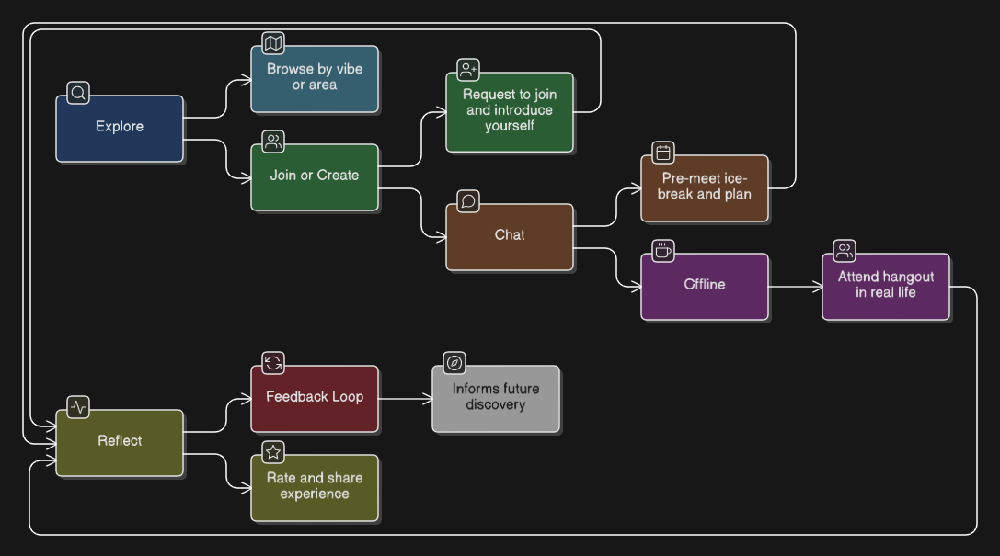
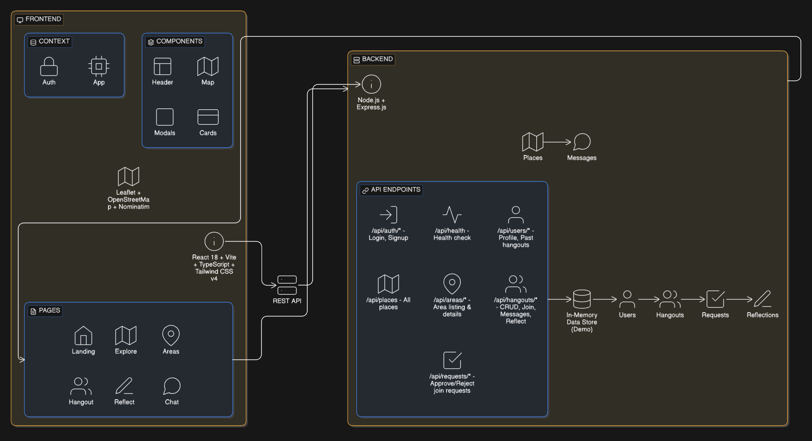
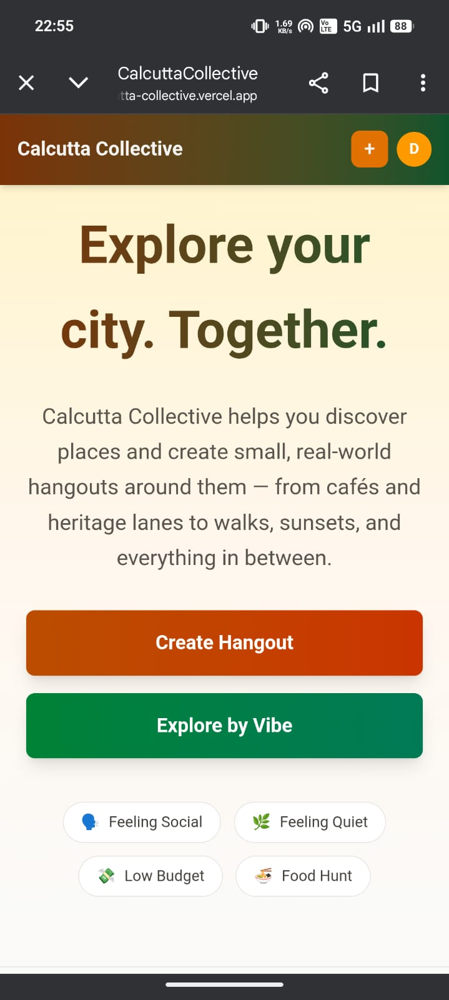
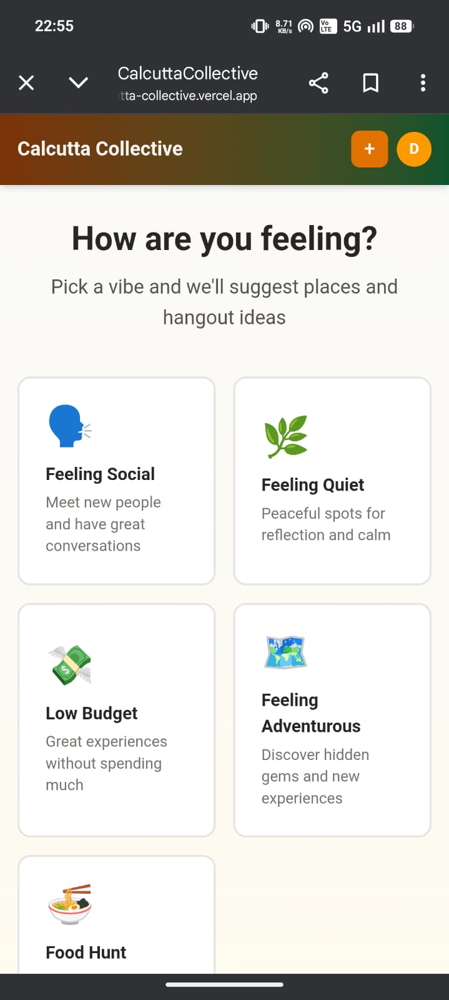
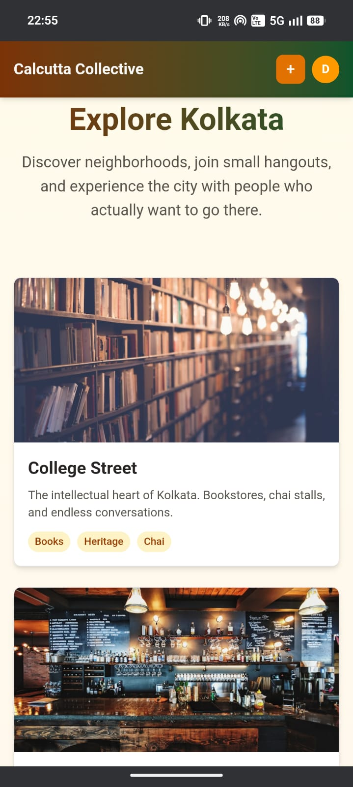
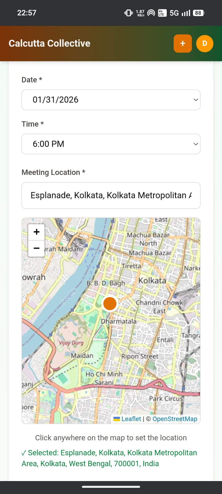
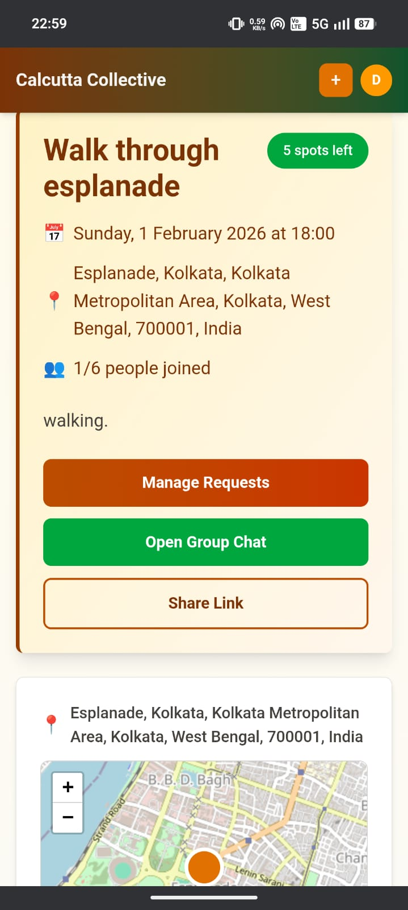
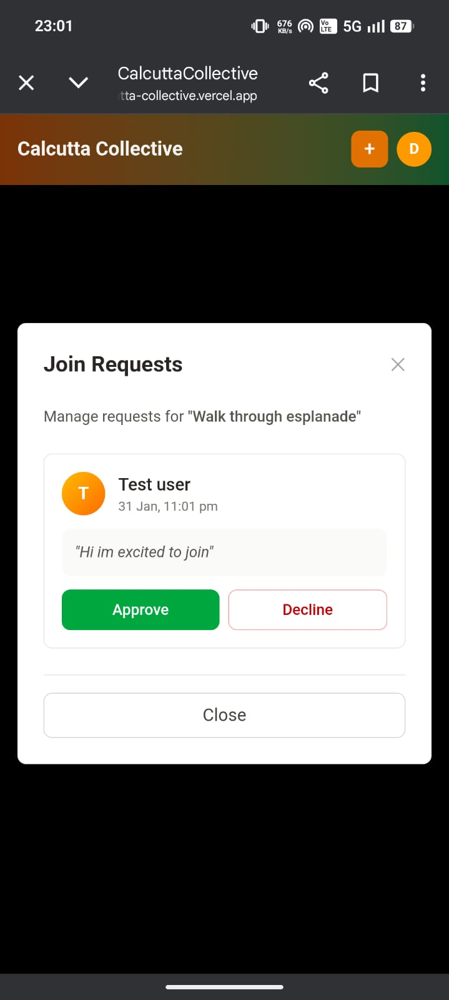
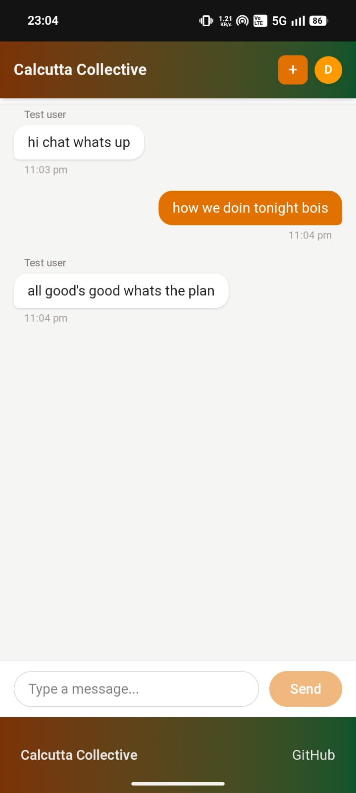
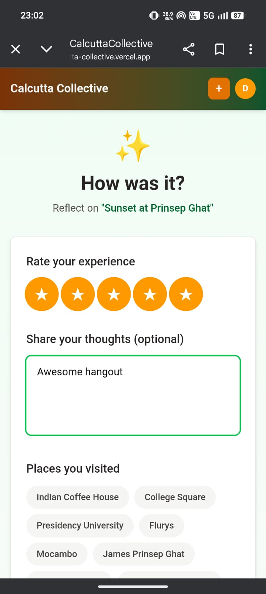

# Calcutta Collective

**A location-first PWA for turning city discovery into real-world hangouts.**

🔗 [Live Demo](https://calcutta-collective.vercel.app) · [Backend API](https://calcuttacollective.onrender.com/api/health)

---

## Context & Credibility

### Competition Background

This project was developed and pitched at:
- **BPlan @ Kshitij 2025** (IIT Kharagpur)
- **Hult Prize 2025** (HITK Campus Round)

It was built primarily as a **competition product** — designed for live demos under time constraints, with a focus on demonstrating a working MVP rather than production-scale infrastructure.

### Team & Acknowledgements

**Product Development:** Built solo by [me](https://suparno.me).

**Pitched alongside:**
- [Aritra](https://www.linkedin.com/in/aritra-maity-a7526b324/) 
- [Dhrubaparna](https://www.linkedin.com/in/dhrubaparna-mazumder-6b1825328/)
- [Ayushi](https://www.linkedin.com/in/ayushi-chakraborty-a12202359/)

*(Check collaborators to see their GitHubs)*

---

## Problem Framing

### The Urban Isolation Problem

Cities are full of people — and yet urban loneliness is rising. People scroll through location posts, save cafés they'll never visit, and spend weekends defaulting to the same routines.

**The issue isn't lack of information. It's lack of activation.**

### Why Existing Solutions Fail

| Platform Type | Problem |
|---------------|---------|
| **Review apps** (Zomato, Google Maps) | Optimized for transactions, not experiences. You find a place, not a reason to go. |
| **Event platforms** (Meetup, BookMyShow) | Too formal, too large, too much commitment. Not everyone wants to attend "events". |
| **Social media** (Instagram, YouTube) | Influencer-led discovery. Passive consumption. No bridge to real-world action. |

### The Gap

- **Discovery ≠ Action** — Saving a reel is not the same as going outside.
- **Online ≠ Offline** — Engagement metrics don't translate to real experiences.
- **Information ≠ Intention** — Knowing about a place doesn't mean you'll visit it.

Calcutta Collective exists to close this gap — by turning discovery into small, real-world hangouts.

---

## Product Hypothesis

The app's design is driven by specific, testable assumptions:

| Hypothesis | Design Response |
|------------|-----------------|
| **Location-first discovery lowers activation friction** | Map-driven UX. Areas before listings. Visual context before details. |
| **Approval-based joining increases safety & trust** | Hosts approve join requests. No open joins. Participants see who they'll meet. |
| **Pre-hangout chat reduces social anxiety** | Group chat unlocks after approval. Ice-breaking happens before meeting. |
| **Post-hangout reflection creates long-term value loops** | Reflections feed back into discovery. Real experiences > reviews. |
| **Small groups feel safer than large events** | Max 5-8 participants. Intimate, not overwhelming. |
| **Vibe-based exploration matches intent** | "Feeling Social" vs "Feeling Quiet" — mood-first, not rating-first. |

These aren't proven — they're **intentional design choices** meant to be validated.

---

## Canonical User Flow



---

## System Design

### Architecture Overview



### Data Models

| Entity | Key Fields |
|--------|------------|
| **User** | id, email, name, bio, pastHangoutsCount |
| **Area** | id, name, description, vibe[], image |
| **Place** | id, areaId, name, type, lowCost |
| **Hangout** | id, title, description, date, time, location, lat/lng, participants[], createdById |
| **JoinRequest** | id, hangoutId, userId, message, status (pending/approved/rejected) |
| **Message** | id, hangoutId, senderId, senderName, text, timestamp |
| **Reflection** | id, hangoutId, userId, rating, reflection, placesVisited[], photoUrl |

### Key Endpoints

| Method | Endpoint | Description |
|--------|----------|-------------|
| `GET` | `/api/health` | Health check |
| `POST` | `/api/auth/signup` | Create account |
| `POST` | `/api/auth/login` | Login |
| `GET` | `/api/areas` | List areas |
| `GET` | `/api/areas/:id` | Area detail + places + hangouts |
| `GET` | `/api/places` | All places |
| `GET` | `/api/hangouts` | List hangouts |
| `POST` | `/api/hangouts` | Create hangout |
| `GET` | `/api/hangouts/:id` | Hangout detail |
| `POST` | `/api/hangouts/:id/request` | Request to join |
| `GET` | `/api/hangouts/:id/requests` | Check request status |
| `POST` | `/api/requests/:id/approve` | Approve join request |
| `POST` | `/api/requests/:id/reject` | Reject join request |
| `GET` | `/api/hangouts/:id/messages` | Get chat messages |
| `POST` | `/api/hangouts/:id/messages` | Send message |
| `POST` | `/api/hangouts/:id/reflect` | Submit reflection |

---

## Key Engineering Decisions

### Why PWA over Native?

- **Zero install friction** — Users can try immediately
- **Competition demo-friendly** — Works on any device with a browser
- **Cross-platform by default** — No separate iOS/Android builds
- **Good enough for MVP** — For testing product hypotheses, native adds complexity without proportional value

### Why Approval-Based Joining?

Open joins feel unsafe for small, real-world meetups. The approval flow:
1. Creates accountability (hosts vet participants)
2. Allows intro messages (soft ice-breaking)
3. Prevents spam joins
4. Mirrors how real-life plans form ("Can I bring a friend?" → "Sure, who?")

### Why Maps Are Central to UX

Location is the atomic unit of this product. Maps:
- Make hangout locations concrete, not abstract
- Enable "where" before "what"
- Leverage spatial intuition over list fatigue
- Differentiate from text-heavy review apps

### Why Recommendations Are Hard-Coded

Vibe-based recommendations (Social, Quiet, Budget, etc.) are currently static. This is intentional:
1. **Demo realism** — App feels populated without a cold-start problem
2. **Hypothesis testing** — We're testing if vibe-first discovery works, not if our ML model is good
3. **Time constraints** — Competition timeline didn't allow for recommendation engine

If validated, recommendations would be learned from reflection data.

### Why Dead Ends Were Removed

Earlier versions had "Featured Hangouts" that linked to `/create` instead of real hangouts. This was:
- Confusing (users expected to see a hangout, not create one)
- Misleading (fake data pretending to be real)

**Fix:** Section now pulls from actual `/api/hangouts` and links to real hangout pages.

---

## Screenshots

<p align="center">
  
  
  
  
  
  
  
  
</p>

---

## Running Locally

### Requirements

- Node.js 18+
- npm

### Setup

```bash
# Clone the repo
git clone https://github.com/letsbecool9792/CalcuttaCollective.git
cd CalcuttaCollective

# Install backend dependencies
cd backend
npm install

# Install frontend dependencies
cd ../frontend
npm install
```

### Start Development Servers

```bash
# Terminal 1 - Backend (port 3001)
cd backend
npm start

# Terminal 2 - Frontend (port 5173)
cd frontend
npm run dev
```

### Verify Setup

```bash
curl http://localhost:3001/api/health
# → { "status": "ok", "timestamp": ..., "uptime": ... }
```

### Demo Credentials

```
Email: demo@calcuttacollective.com
Password: demo123
```

---

## Tech Stack

| Layer | Technology |
|-------|------------|
| Frontend | React 18, TypeScript, Vite, Tailwind CSS v4 |
| Routing | React Router v6 |
| Maps | Leaflet, React-Leaflet, OpenStreetMap, Nominatim |
| Backend | Node.js, Express.js |
| Data | In-memory store (demo) |
| Deployment | Vercel (frontend), Render (backend) |

---

